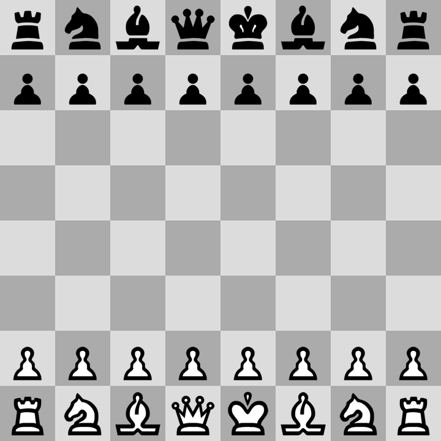
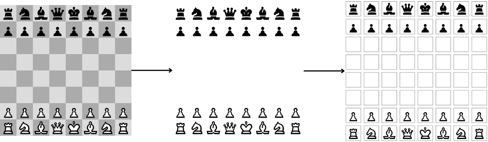
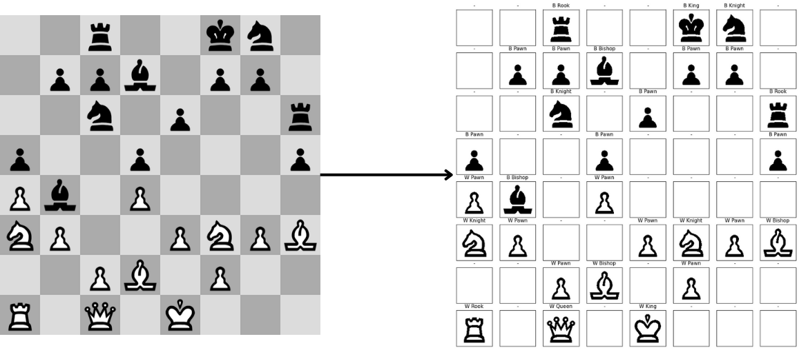

# Clasificacion de piezas de ajedres con correlacion de area
En este repositorio se presenta un metodo sencillo para clasificar piezas de ajedrez en un tablero. A diferencia de los enfoques tradicionales basados en aprendizaje profundo, se aborda el problema con correlacion de area, lo cual nos permite implementar un metodo simple e intuitivo que se demepena bien bajo ambientes controlados.

## Descripcion del metodo
La clasificacion de las piezas se realiza con la informacion del area de cada pieza. Para reunir dicha informacion se trabaja con tableros de la pagina [Chess](www.chess.com):

Para construir el conjunto de datos con el trabajar el clasificador ***kNN***, se binariza la imagen del tablero y se divide la informacion de cada casilla:

Posteriormente, para cada pieza, se divide la imagen en ventanas y se cuenta el numero de pixeles negros en cada una:

De esta manera, se obtienen un vectores de nueve entradas que representa la informacion de cada pieza.

En cuanto a las predicciones, cada tablero se procesa con el metodo descrito anteriormente, hasta calcular el area de cada casilla. Finalmente, se utiliza ***kNN*** para predecir la pieza mas similar a cada casilla y asignar una etiqueta:

