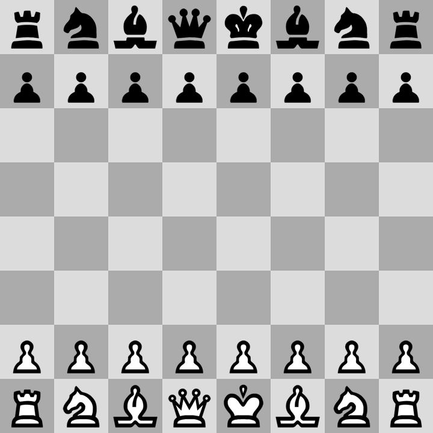
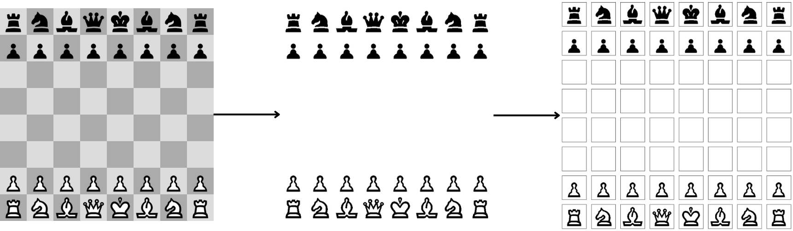
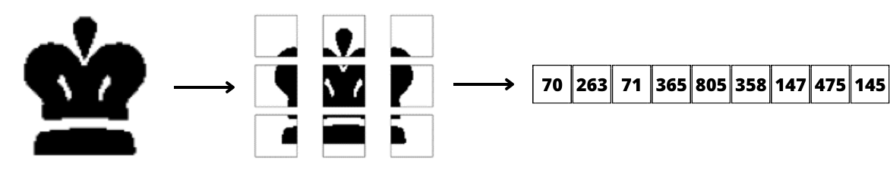
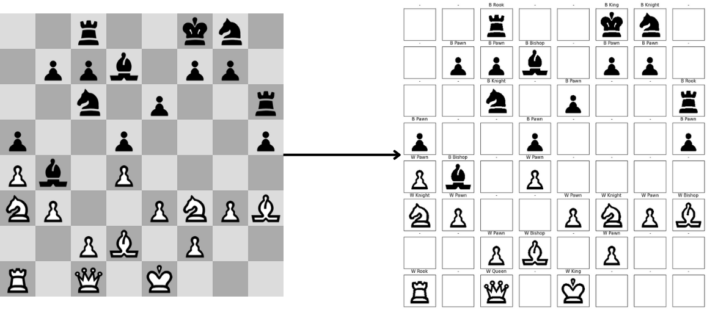

# Clasificación de piezas de ajedres con correlacion de area
En este repositorio se presenta un método sencillo para clasificar piezas de ajedrez en un tablero. A diferencia de los enfoques tradicionales basados en aprendizaje profundo, se aborda el problema con correlación de área y un clasificador _k-NN_, lo cual nos permite implementar un método simple e intuitivo que se desempeña bien bajo ambientes controlados.

## Descripción del metodo
La clasificación de las piezas se realiza con la información del área de cada pieza. Para reunir dicha información, se trabaja con tableros de la página [Chess](https://www.chess.com/es):



Para construir el conjunto de datos con el que trabajará el clasificador _k-NN_, se binariza la imagen del tablero y se divide la información de cada casilla:



Posteriormente, para cada pieza, se divide la imagen en ventanas y se cuenta el número de pixeles negros en cada una:



De esta manera, se obtienen vectores de nueve entradas que representan la informacion de cada pieza.

En cuanto a las predicciones, cada tablero se procesa con el metodo descrito anteriormente para calcular el area de cada casilla. Finalmente, se utiliza *k-NN* para predecir la pieza más similar a cada casilla y asignar una etiqueta:



## Instalación
Clona o descarga este repositorio:
```bash
git clone git@github.com:daniel-lima-lopez/Chess-pieces-classification-with-area-correlation.git
```

## Uso
Para instanciar al clasificador es necesario importar la clase:
```python
from ChessClassifier import Classifier

classifier = Classifier()
```

Posteriormente, para realizar una predicción se debe incluir la ubicación del tablero a clasificar:
```python
classifier.predict('path')
```

Se incluyen [tableros](test/) para probar el clasificador.
